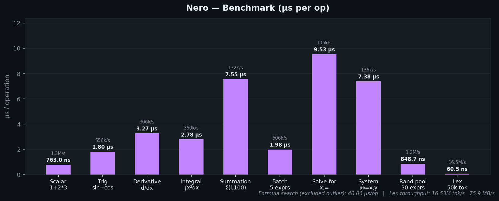

# Nero

<div style="text-align: center;" align="center">
    
    <hr>
</div>

A C++23 library for evaluating LaTeX math expressions with builtin dimensional analysis and formula finding. Nero supports both a C++ interface as well as a WASM one for use in the browser.\
For a demo of Nero being used in a React application, see [Everett](https://github.com/Illusion137/Everett). For the demo of Everett, see [Everett Demo](https://sumii.me/everett.html).

## Installation as Library

```bash
git clone https://github.com/Illusion137/Nero.git
```

### Build

```bash
# Native
cmake -S . -B build
cmake --build build
./build/NeroTest        # runs tests
./build/NeroBenchmark   # runs benchmarks

# WASM (requires Emscripten)
emcmake cmake -S . -B build-wasm
cmake --build build-wasm
# Outputs: build-wasm/Nero.js, build-wasm/Nero.wasm, build-wasm/Nero.d.ts

# If your using msys2 on windows use
C:\msys64\usr\bin\bash.exe -lc "cd '$(pwd)' && cmake --build build"
```

### Add built WASM library to HTML

```html
<!DOCTYPE html>
<html lang="en">
	<head>
		<meta charset="UTF-8" />
		<link rel="icon" type="image/webp" href="/nero.webp" />
		<meta name="viewport" content="width=device-width, initial-scale=1.0" />
		<!-- [ADD THIS LINE BELOW] -->
		<script src="/wasm/Nero.js"></script>
		<title>Everett</title>
	</head>
	<body class="vscode-dark">
		<div id="root"></div>
		<script type="module" src="/src/main.tsx"></script>
	</body>
</html>
```

### Example File Structure

```
.
├── index.html
├── package.json
├── public
│   └── wasm
│       ├── Nero.js
│       └── Nero.wasm
├── src
│   ├── App.css
│   ├── App.tsx
│   ├── Nero.d.ts
│   ├── index.css
│   ├── main.tsx
│   ├── nero_wasm_interface.ts
│   ├── utils.ts
│   └── vite-env.d.ts
├── tsconfig.app.json
├── tsconfig.json
├── tsconfig.node.json
├── vite.config.ts
└── yarn.lock
```

### Installation as a CMake dependency

```cmake
include(FetchContent)
FetchContent_Declare(
    Nero
    GIT_REPOSITORY https://github.com/Illusion137/Nero.git
    GIT_TAG        main
)
FetchContent_MakeAvailable(Nero)

target_link_libraries(your_target PRIVATE NeroLib)
```

## Usage

### Evaluate Single Expression

```cpp
#include "evaluator.hpp"

nero::Expression single_expression = nero::Expression{.value_expr = "13 + 7", .unit_expr="\\mm^{2}"}; // -> 2 * 10^{-5} m^2
nero::Evaluator evaluator{};
const auto &result = evaluator.evaluate_expression(single_expression);
if(!result) { // Bad result
    // handle bad result
    std::string err = result.error();
    return -1.0;
}
// Single value
if (auto p = std::get_if<nero::UnitValue>(&result.value())) return p->value;
// Multiple values
if (auto p = std::get_if<nero::UnitValueList>(&result.value())) return p->elements.empty() ? 0.0L : p->elements[0].value;
// Boolean value
if (auto p = std::get_if<nero::BooleanValue>(&result.value())) return p->value ? 1.0L : 0.0L;
```

Notice how the value can be many things. Not limited to just these; values can also be `UnitValue`, `UnitValueList`, `BooleanValue`, `Function`, `VoidValue`, `VectorValue`.

## What it does

Parses and evaluates LaTeX expressions in sequence, with a shared variable context. Results carry SI unit vectors so dimensional errors are caught at eval time.

```
x = 5.6
y = 3.21
z = x * y       → 17.976 (sig figs: 2)
```

Supported:

-   Arithmetic: `+`, `-`, `*`, `/`, `^`, `\frac{}{}`, `\sqrt{}`, `\sqrt[n]{}`, `\div`
-   Trig / log: `\sin`, `\cos`, `\tan`, `\sec`, `\csc`, `\cot`, `\ln`, `\log`, `\log_b`
-   Combinatorics: `n!`, `\nCr`, `\nPr`
-   Complex numbers (imaginary results propagate automatically)
-   Arrays: `x = [1, 2, 3]`, `x[0]`
-   Piecewise: `\begin{cases} ... \end{cases}`
-   Summation / product: `\sum_{i=1}^{n}`, `\prod_{i=1}^{n}`
-   Plus/minus: `a \pm b` (returns two-element array)
-   Custom functions: `f(x) = x^2`, `f'(x)`, `\frac{d}{dx}(expr)`
-   Numeric integration: `\int_{a}^{b} f(x) \, dx`
-   Logical / comparison: `<`, `>`, `\leq`, `\geq`, `\land`, `\lor`, `\lnot`
-   Modulo: `a \mod b`
-   Percentages: `25\%`
-   Hex / binary literals: `0xFF`, `0b1010`
-   Significant figures: propagated through arithmetic; `\sig(x)` returns the count
-   Unit conversion via `conversion_unit_expr` on the `Expression` struct
-   `\operatorname{ans}` holds the last evaluated result

### Constants

<!-- CONSTANTS_START -->
| Constant       | Description                                    | Value                                              |
| -------------- | ---------------------------------------------- | -------------------------------------------------- |
| $\mathrm{g}$   | Gravitational acceleration                     | $9.8 \ \frac{m}{s^2}$                              |
| $\mathrm{G}$   | Gravitational constant                         | $6.6743 \cdot 10^{-11} \ \frac{Nm^2}{kg^2}$        |
| $\mathrm{e}$   | Euler's number                                 | $2.718281828459$                                   |
| $\mathrm{e_c}$ | Elementary charge                              | $1.602 \cdot 10^{-19} \ C$                         |
| $\mathrm{e_0}$ | Electric constant (permittivity of free space) | $8.854187817 \cdot 10^{-12} \ \frac{F}{m}$         |
| $\epsilon_0$   | Vacuum permittivity (alias for e_0)            | $8.854187817 \cdot 10^{-12} \ \frac{F}{m}$         |
| $\mathrm{k}$   | Coulomb constant                               | $8.99 \cdot 10^9 \ \frac{Nm^2}{C^2}$               |
| $\mu_0$        | Vacuum permeability                            | $4\pi \cdot 10^{-7} \ \frac{H}{m}$                 |
| $\mathrm{c}$   | Speed of light in vacuum                       | $2.99792458 \cdot 10^8 \ \frac{m}{s}$              |
| $\mathrm{m_e}$ | Electron mass                                  | $9.1093837 \cdot 10^{-31} \ kg$                    |
| $\mathrm{m_p}$ | Proton mass                                    | $1.67262192 \cdot 10^{-27} \ kg$                   |
| $\mathrm{m_n}$ | Neutron mass                                   | $1.674927 \cdot 10^{-27} \ kg$                     |
| $\mathrm{R_g}$ | Ideal gas constant                             | $8.31446 \ JK^{-1}mol^{-1}$                        |
| $\mathrm{R_a}$ | Ideal gas constant (atm units)                 | $0.0821 \ \atmLK^{-1}mol^{-1}$                     |
| $\mathrm{C_K}$ | Celsius->Kelvin offset                         | $273.15 \ K$                                       |
| $\mathrm{h}$   | Planck constant                                | $6.62607015 \cdot 10^{-34} \ Js$                   |
| $\mathrm{a_0}$ | Bohr radius                                    | $5.291772 \cdot 10^{-11} \ m$                      |
| $\mathrm{N_A}$ | Avogadro constant                              | $6.022 \cdot 10^{23} \ mol^{-1}$                   |
| $\alpha$       | Fine-structure constant                        | $7.2973525693 \cdot 10^{-3}$                       |
<!-- CONSTANTS_END -->

### Functions

<!-- FUNCTIONS_START -->
#### Basic Math

`sqrt` `ceil` `floor` `round` `abs`

#### Trigonometric

`sin` `cos` `tan` `sec` `csc` `cot`

#### Inverse Trigonometric

`arcsin` `arccos` `arctan` `arcsec` `arccsc` `arccot`

#### Hyperbolic

`sinh` `cosh` `tanh` `sech` `csch` `coth`

#### Inverse Hyperbolic

`arcsinh` `arccosh` `arctanh`

#### Logarithmic

`log` `ln`

#### Statistical

`mean` `std` `var` `median`

#### Combinatorics

`nCr` `nPr`

#### Aggregates

`sum` `prod` `min` `max`

#### Number Theory

`gcd` `lcm`

#### Linear Algebra

`det` `trace`

#### Complex Numbers

`conj` `Re` `Im`

#### Utility

`fact` `sig` `val` `unit` `clamp` `lerp` `norm` `dot` `cross`

#### Integration

`int`

#### Temperature Conversion

`FahrC` `FahrK` `CelK` `CelF`

#### Angle Conversion

`rad` `deg`

#### Other

`sin^{-1}` `cos^{-1}` `tan^{-1}` `sec^{-1}` `csc^{-1}` `cot^{-1}` `tr`
<!-- FUNCTIONS_END -->

## Benchmarks

<!-- BENCH_START -->


| Benchmark      | µs / op    | ops / sec    | op unit |
| -------------- | ---------- | ------------ | ------- |
| Scalar         | 0.76 µs    | 1.31 M/s     | op      |
| Trig           | 1.80 µs    | 555.7 k/s    | op      |
| Derivative     | 3.27 µs    | 306.2 k/s    | op      |
| Integral       | 2.78 µs    | 359.7 k/s    | op      |
| Summation      | 7.55 µs    | 132.4 k/s    | op      |
| Batch          | 1.98 µs    | 506.3 k/s    | expr    |
| Formula search | 40.06 µs   | 25.0 k/s     | op      |
| Solve-for      | 9.53 µs    | 105.0 k/s    | op      |
| System solver  | 7.38 µs    | 135.5 k/s    | op      |
| Random pool    | 0.85 µs    | 1.18 M/s     | expr    |
| Lex            | 0.06 µs    | 16.53 M/s    | token   |

<details>
<summary>Raw numbers</summary>

```
=== Nero Benchmarks ===

Scalar: 1 + 2 * 3                                           76.30 ms       1310603/s
Trig: sin(pi/6) + cos(pi/3)                                 89.98 ms        555664/s
Derivative: d/dx(x^3) at x=2                                32.66 ms        306181/s
Integral: int_0^1 x^2 dx                                    13.90 ms        359662/s
Summation: sum_{i=1}^{100}(i)                               37.76 ms        132421/s
Batch (5 unit-carrying exprs)                               98.75 ms        101263/s
Formula search (acceleration target)                        40.06 ms         24965/s
Solve-for: x^2 - 4 ; x :=                                   28.58 ms        104981/s
System solver: x+y=5, x-y=1 ; @=x,y                         14.76 ms        135538/s
Random pool (30 exprs, 1000 rounds)                         25.46 ms         39280/s

--- Lex Throughput ---
Lex: 50k-token string (all token types)                   1512.65 ms           331/s
  Tokens/sec: 16.53M   Throughput: 75.9 MB/s
```

</details>
<!-- BENCH_END -->

## C++ usage

```cpp
#include "evaluator.hpp"

nero::Evaluator eval;

// Single expression
auto result = eval.evaluate_expression({"x^2 + 1", ""});

// Batch — expressions share variable state
std::vector<nero::Expression> exprs = {
    {"r = 5.0", "\\m"},
    {"T = 2.0", "\\s"},
    {"v = r / T", ""},
};
auto results = eval.evaluate_expression_list(exprs);
// results[2] → UnitValue { value: 2.5, unit: [1,-1,0,0,0,0,0] }  (m/s)
```

`MaybeEvaluated` is `std::expected<EValue, std::string>`.

`EValue` is `std::variant<UnitValue, UnitValueList, BooleanValue, Function>`.

## WASM / TypeScript usage

### Building

```bash
emcmake cmake -S . -B build-wasm
cmake --build build-wasm
# Outputs: build-wasm/Nero.js  build-wasm/Nero.wasm  build-wasm/Nero.d.ts
```

Precompiled WASM artifacts are also available on the [GitHub Releases](https://github.com/Illusion137/Nero/releases) page.

### TypeScript interface

Copy `nero_wasm_interface.ts` into your project alongside the generated `Nero.js`/`Nero.wasm` files, then:

```typescript
import createModule from "./Nero.js";
import { DimensionalEvaluator } from "./nero_wasm_interface";

const Module = await createModule();
const evaluator = new DimensionalEvaluator(Module);

// Single expression
const [result] = evaluator.eval_batch(["x^2 + 1"], [""], [""]);
if (result.success) {
	console.log(result.value); // numeric value
	console.log(result.unit_latex); // LaTeX unit string, e.g. "\\mathrm{m}"
	console.log(result.value_scientific); // formatted string with sig figs
}

// Batch — expressions share variable context
const results = evaluator.eval_batch(
	["r = 5.0", "T = 2.0", "v = r / T"],
	["\\m", "\\s", ""],
	["", "", "\\frac{\\km}{\\hour}"] // optional conversion units
);
// results[2] → { value: 2.5, unit_latex: "\\mathrm{\\frac{m}{s}}", success: true, ... }
```

Each result object has the shape:

```typescript
{
    value: number;           // real part of the numeric result
    imag: number;            // imaginary part (0 when real)
    unit: number[];          // SI unit vector [m, s, kg, A, K, mol, cd]
    success: boolean;
    error: string;           // non-empty when success=false; "function" when result is a Function
    unit_latex: string;      // LaTeX string for the unit
    value_scientific: string; // formatted value (respects sig figs when applicable)
    sig_figs: number;        // significant figures count (0 = unlimited/exact)
}
```
